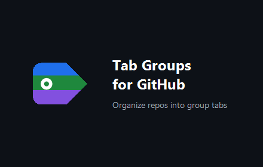

# Tab Groups for GitHub

Organize GitHub repositories into custom groups and browse each group as a tab on the
Repositories page of any user or organization — across pagination, all in one place.

**No servers, fully private.** Everything you create stays in your own browser storage; the
extension sends nothing to the developer or any third party. No analytics, no tracking.

> **Unofficial.** This is an unofficial tool and is not affiliated with or endorsed by
> GitHub, Inc. "GitHub" is a trademark of GitHub, Inc.



## Features

- Group tabs injected above the repository list. "All" shows GitHub's native list; each group
  tab shows just that group's repositories, spanning every page.
- Assign repositories to groups in one click with a familiar GitHub-style picker.
- Manage groups on the page: rename, recolor, reorder, delete, and create.
- Groups are kept completely separate per account (user vs organization).
- Bookmarkable: each group has its own URL, and the page title reflects the active group.
- Works on profile and organization Repositories pages, light and dark themes.
- English / Japanese UI (auto-detected, switchable).
- Optional cloud sync across your Chrome browsers via Chrome's built-in account sync — no
  external server, no tokens.

## Tech stack

- Chrome extension, Manifest V3, plain JavaScript (no build step, no npm dependencies).
- Permissions: `storage` and host access to `https://github.com/*` only.

## Install

Not yet on the Chrome Web Store. To run the current source as an unpacked extension:

1. Open `chrome://extensions` and enable **Developer mode**.
2. Click **Load unpacked** and select this repository's root folder (the one containing
   `manifest.json`).
3. Visit any GitHub user or organization Repositories page.

To build the distribution zip that gets uploaded to the store, run the packaging script for
your OS (output goes to `dist/`):

```sh
bash scripts/package.sh      # macOS / Linux
```

```powershell
pwsh scripts/package.ps1     # Windows / PowerShell
```

Both copy only the runtime files (`manifest.json`, `popup.*`, `src/`, `_locales/`, `icons/`,
`LICENSE`) into the archive.

## Development / testing

There is no `package.json`; tests run directly with Node (24.x, as CI uses):

```sh
node test/storage.test.cjs   # storage-layer unit tests
node test/checks.cjs         # static checks: manifest / locales / i18n consistency
```

CI (`.github/workflows/ci.yml`) runs both plus a `node --check` syntax pass on the source
files, on push / PR to the `release` branch.

## Privacy & license

- Privacy policy: `PRIVACY.md` (nothing is collected or transmitted).
- License: MIT — see `LICENSE`.
- Chrome Web Store submission text and asset checklist: `STORE_LISTING.md`.
